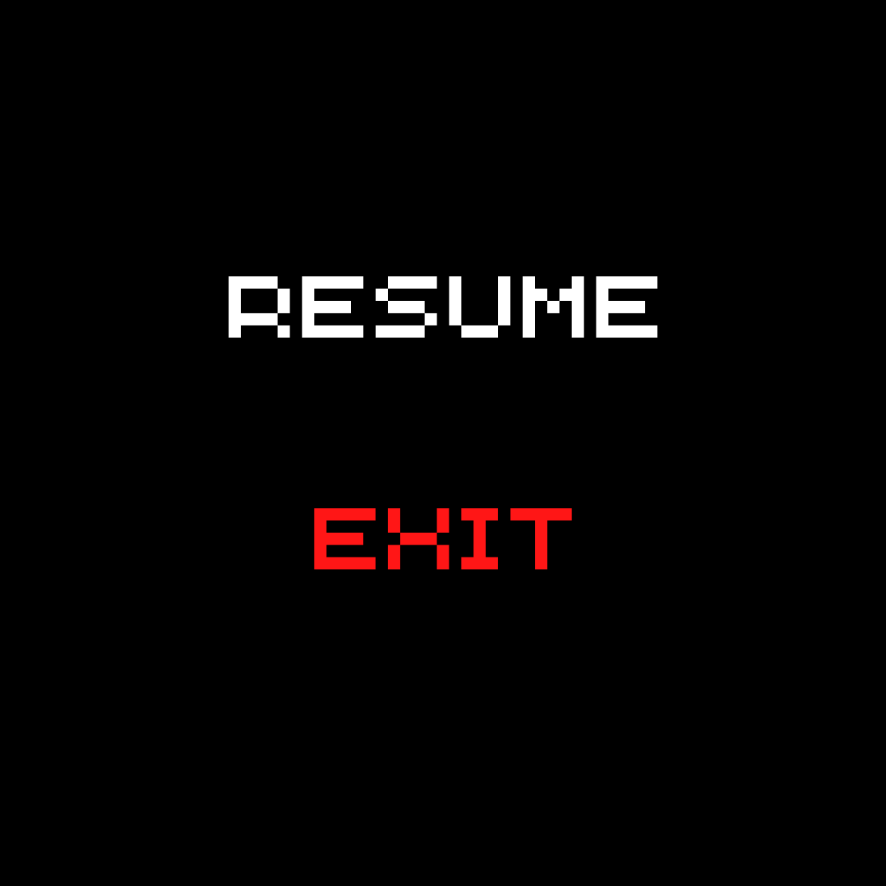
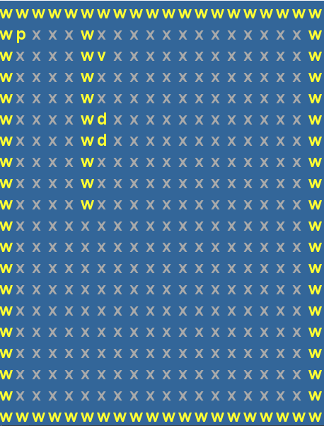
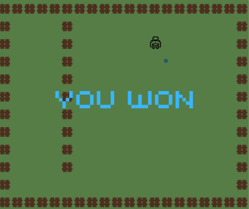
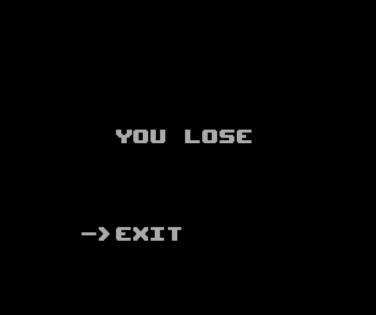

## LDTS_T10_G1002 - FATE

### Game Description

This project consists in a 2D looter shooter game, where the inspirations are Destiny and Pokemon.
The game consists of one player and different monsters, which depend on different levels. The player has 3 types of weapons with their own characteristics, which are used to kill monsters and get to the next level. Monsters can also shoot the player, and depending on which one it is, it may have more health and deal more damage than others.

### Features

- **Connected Menus** - The user has the capability of browsing through the different menus including in game ones. (Ex: Main Menu, Instructions, Play, Pause).
- **Buttons** - Functional and interactive buttons.
- **Keyboard control** - The keyboard inputs are received through the respective events and interpreted according to the current game state.
- **Player control** - The player may move with the keyboard control (keys - a,w,s,d) and shoot his gun when the space-bar is pressed.
- **Collisions detection** - Collisions between different objects are verified. (Ex: Player, Bullet, Enemies, Obstacles).
- **Different levels** - 8 different levels with an increasing difficulty were implemented.
- **Different weapons** - The player will be able to earn and collect 3 weapons from different types, classes and rarity.
- **Different enemies** - 6 different types of enemies with distinct speed, health and damage.
- **Hub** - There is a hub called Tower, where the player can interact with different npcs and proceed the history, as well as replay the missions if they want to.
- **Animations** - In this game, damage caused by the player or by the enemies is seen in animated forms.

### Mockups

The following screenshots ilustrate the general look of our game, as well as the divergent functionalities:
### Game preview

  <b><i>Gif 1. Overview of FATE game</i></b>

 
 

### Menus

  <b><i>Fig 1. Main Menu </i></b>

 
 

  <b><i>Fig 2. Instructions Menu </i></b>

 
 

  <b><i>Fig 3. Pause Menu </i></b>

  

 
 

###Enemies

  <b><i>Fig 4. Dreg Enemy </i></b>

  

 
 

  <b><i>Fig 5. Vandal Enemy </i></b>

  

 
 

  <b><i>Fig 6. Captain Enemy </i></b>

  

 
 

### Levels

  <b><i>Fig 7. Level 1 </i></b>

 
 

### Animations

  

  <b><i>Gif 2. Damage caused by the shoots</i></b>

 
 

### End Game

  <b><i>Fig 8. Won message</i></b>

 
 

  <b><i>Fig 9. Lost message</i></b>

