## LDTS_T10_G1002 - FATE

### Game Description

This project consists in a 2D looter shooter game, where the inspirations are Destiny and Pokemon.
The game consists of one player and different monsters, which depend on different levels. The player has 3 types of weapons with their own characteristics, which are used to kill monsters and get to the next level. Monsters can also shoot the player, and depending on which one it is, it may have more health and deal more damage than others.

This project was developed by Eduardo da Silva (up202004999@fe.up.pt), Ian Gomes (up202000707@fe.up.pt) and Igor Diniz (up202000162@fe.up.pt) for LDTS 2021-22.

### Implemented Features

- **Buttons** - Functional and interactive buttons.
- **Keyboard control** - The keyboard inputs are received through the respective events and interpreted according to the current game state.
- **Player control** - The player may move with the keyboard control (keys - a,w,s,d) and shoot his gun when the 'e' is pressed.
- **Animations** - In this game, damage caused by the player or by the enemies is seen in animated forms.
- **Connected Menus** - The user has the capability of browsing through the different menus including in game ones. (Ex: Main Menu, Instructions, Play, Pause).
- **Collisions detection** - Collisions between different objects are verified. (Ex: Player, Bullet, Enemies, Obstacles).
- **Different levels** - 5 different levels with an increasing difficulty were implemented.
- **Different weapons** - 3 different types of weapons and 7 weapons (3 primaries, 2 specials and 2 heavies).
- **Different enemies** - 6 different types of monsters with distinct speed, health and damage.

### Planned Features
All planned features were implemented.

###  **Overview**

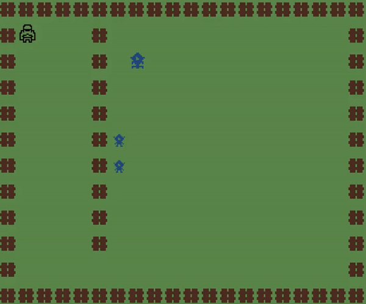

  <b><i>Gif 1. Overview of FATE game</i></b>

 
 

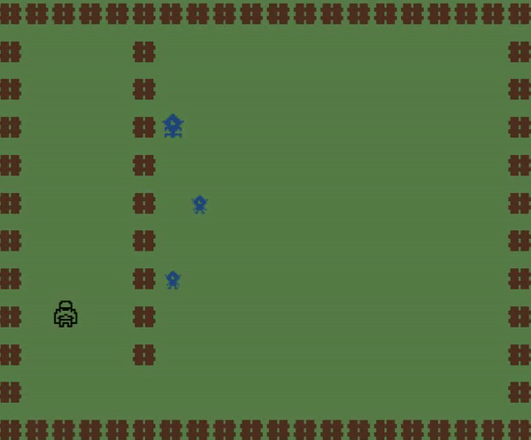

  <b><i>Gif 2. Damage caused by the shoots</i></b>

 
 

###  **GUI Mockups**
### Menus
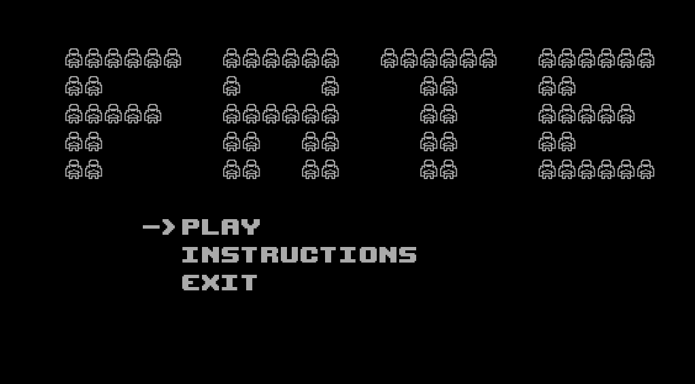

  <b><i>Fig 1. Main Menu </i></b>

 
 

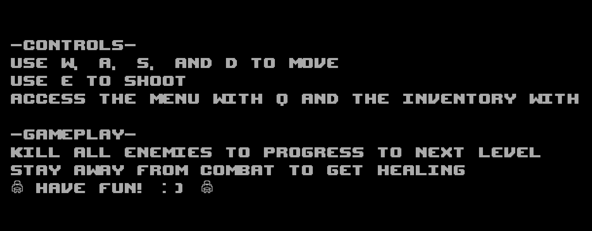

  <b><i>Fig 2. Instructions Menu </i></b>

 
 

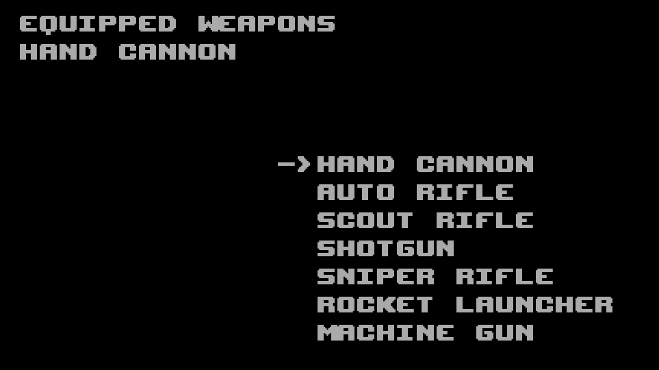

  <b><i>Fig 3. Inventory Menu </i></b>

  

### Enemies

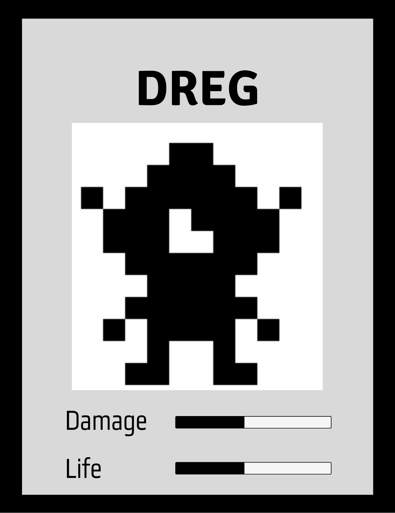

  <b><i>Fig 4. Dreg Enemy </i></b>

  

 
 

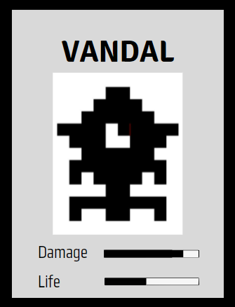

  <b><i>Fig 5. Vandal Enemy </i></b>

  

 
 

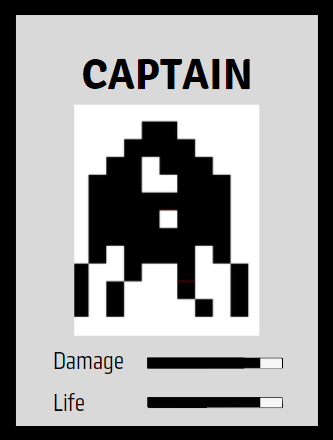

  <b><i>Fig 6. Captain Enemy </i></b>

  

 
 

### Design

### UML Diagrams

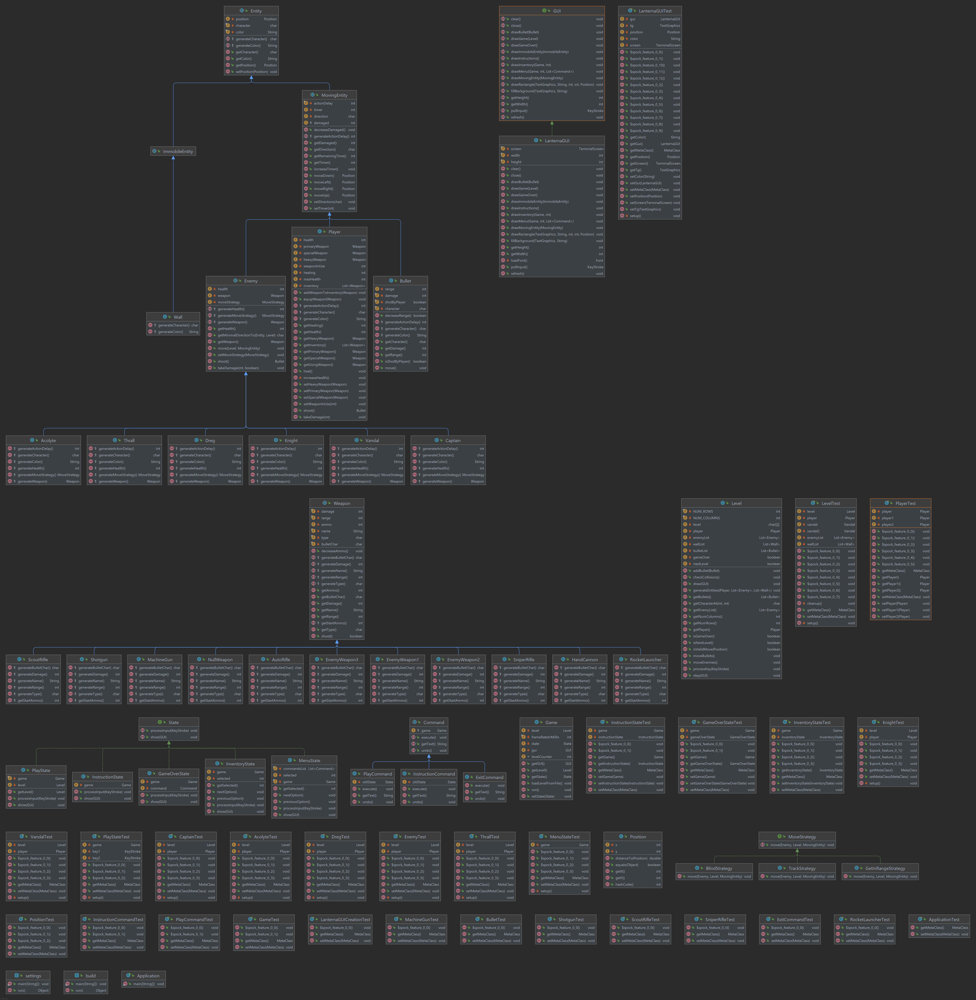

### Creating new Enemies and new Weapons

**Problem in Context**

As new types of enemies and of weapons were created, it was necessary to make big changes in the main code of the game, in order to change the behavior of the game according to the enemy and weapon that had been created. Thus, many conditionals were needed to effect this behavior change.

**The Pattern**

The factory method pattern was used to replace direct entity construction methods with calls to an enemy factory. This pattern allowed to solve the problem, since it was possible to create enemies and weapons without significantly changing the code, through the abstract method generateCharacter.

**Implementation**

The following figure shows how the pattern’s roles were mapped to the application classes.
  
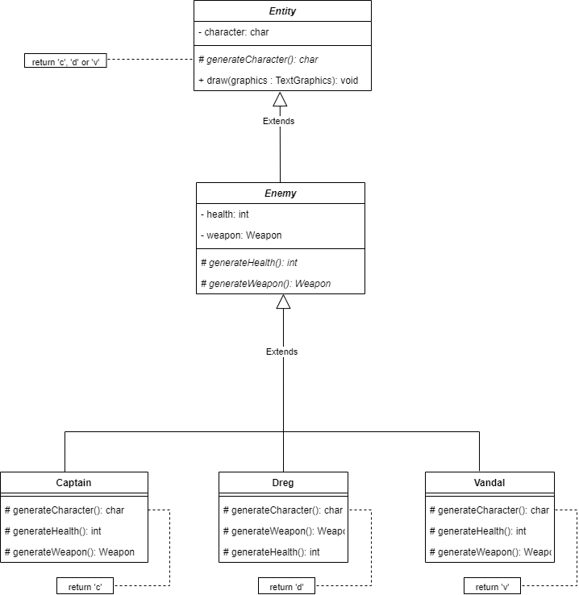
 
  <b><i>Fig 7. Factory Method implementation</i></b>
   

These classes can be found in the following files:

- [Entity](../src/main/java/game/entities/Entity.java)
- [Enemy](../src/main/java/game/enemies/Enemy.java)
- [Captain](../src/main/java/game/enemies/Captain.java)
- [Dreg](../src/main/java/game/enemies/Dreg.java)
- [Vandal](../src/main/java/game/enemies/Vandal.java)

**Consequences**

The use of the Factory Method Pattern in the current design allows the following benefits:

- It's very easy to add new enemies and new weapons to the game without having to make changes to the main code;
- Removes the need to recreate the same code every time a new enemy is created;

### Changing game state

**Problem in Context**

As the number of states of our game increased, the need to
organize this different states and how they change to it other increased as well.

**The Pattern**

To solve this problem we used the State Pattern which is a behavioral design pattern that lets an object alter its behavior when its internal state changes.

**Implementation**

The following figure shows how the pattern’s roles were mapped to the application classes.
  
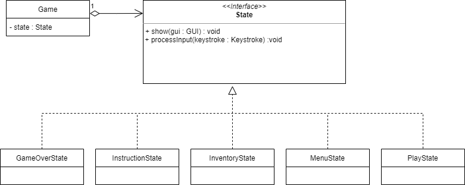
 
<b><i>Fig 8. State Pattern implementation</i></b>
 

These classes can be found in the following files:

- [Game](../src/main/java/game/Game.java)
- [State](../src/main/java/game/state/State.java)
- [GameOverState](../src/main/java/game/state/GameOverState.java)
- [InventoryState](../src/main/java/game/state/InventoryState.java)
- [InstructionState](../src/main/java/game/state/InstructionState.java)
- [MenuState](../src/main/java/game/state/MenuState.java)
- [PlayState](../src/main/java/game/state/PlayState.java)

**Consequences**

The use of the State Pattern in the current design allows the following benefits:
- The several states of the game become explicit in the code, instead of relying on a series of flags;
- Easy to add new states to the game during the development;
- A well organized code acknowledging the Single Responsibility Principle;

### Moving Enemies

**Problem in Context**

We wanted to make enemies move in different ways and be able to change the way they move at runtime

**The Pattern**

To solve this problem we used the Strategy Pattern, which is a behavioral pattern that lets we define a family of algorithms put each of them into a separate class, and make their objects interchangeable.

**Implementation**

The following figure shows how the pattern’s roles were mapped to the application classes.
  
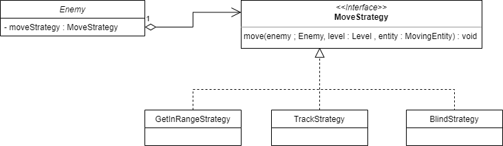
 
<b><i>Fig 9. Strategy Pattern implementation</i></b>
 

These classes can be found in the following files:

- [Enemy](../src/main/java/game/enemies/Enemy.java)
- [MoveStrategy](../src/main/java/game/enemies/strategy/MoveStrategy.java)
- [BlindStrategy](../src/main/java/game/enemies/strategy/BlindStrategy.java)
- [GetInRangeStrategy](../src/main/java/game/enemies/strategy/GetInRangeStrategy.java)
- [TrackStrategy](../src/main/java/game/enemies/strategy/TrackStrategy.java)

**Consequences**

- We are able to change the movement strategy of enemies during the game;
- We can add strategis without having to change the main code, what is in order with the Open/Closed Principal;
- The code of the strategis is isolated from the code that uses it;

### Menu Bottoms

**Problem in Context**

When we were creating the menus for the game, we saw that each buttom had its way of executing a task, and since we thought many other buttoms would show up with the more menus we added, the need to refactor the way we were doing this increased.

**The Pattern**

We have applied the Command Pattern. This pattern turns a request into a stand-alone object that contains all information about the request.

**Implementation**

The following figure shows how the pattern’s roles were mapped to the application classes.
  
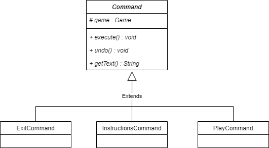
 
<b><i>Fig 10. Command Pattern implementation</i></b>
 

These classes can be found in the following files:

- [Command](../src/main/java/game/state/command/Command.java)
- [ExitCommand](../src/main/java/game/state/command/ExitCommand.java)
- [InstructionCommand](../src/main/java/game/state/command/InstructionCommand.java)
- [PlayCommand](../src/main/java/game/state/command/PlayCommand.java)

**Consequences**

- We can decouple classes that invoke operations from classes that perform these operations (SRP);
- We can implement undo/redo;
- We can assemble a set of simple commands into a complex one;
- The code may become more complicated since you’re introducing a whole new layer between senders and receivers;

### Lanterna GUI

**Problem in Context**

It was getting hard to keep track of everything related to lanterna and all its features spread across all the code.

**The Pattern**

To solve this, we used the Facade Pattern, which is a structural pattern that provides a simplified interface to, in this case, lanterna

**Implementation**

The following figure shows how the pattern’s roles were mapped to the application classes.
  
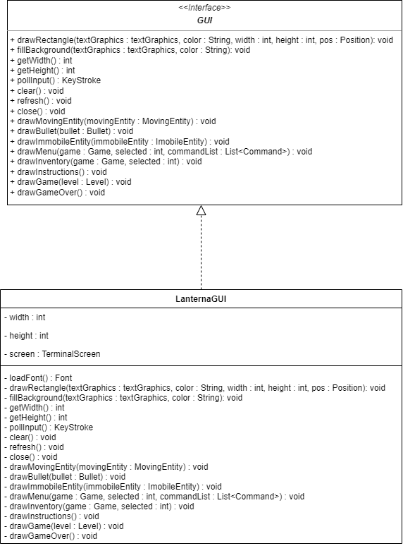
 
<b><i>Fig 11. Facade Pattern implementation</i></b>
 

These classes can be found in the following files:

- [GUI](../src/main/java/game/gui/GUI.java)
- [LanternaGUI](../src/main/java/game/gui/LanternaGUI.java)

**Consequences**

- The code related to the Lanterna was isolated from the main code of the game;
- Testing for the tool has been made easier;
- Keep track of everything we are using from the framework was facilitated;

### Null Weapon

**Problem in Context**

Since the player can have no weapons equiped, in many places we had the need to check if the player's weapon was null.

**The Pattern**

The Null Object Pattern is a pattern used to avoid all this null checking and giving a default behaviour in case no real object is given.

**Implementation**

The following figure shows how the pattern’s roles were mapped to the application classes.
  
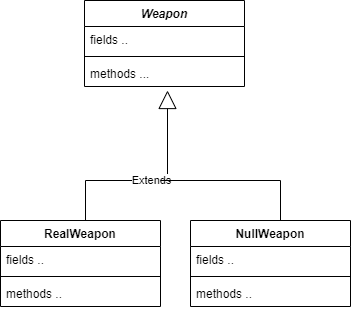
 
<b><i>Fig 12. Null Pattern implementation</i></b>
 

These classes can be found in the following files:

- [Weapon](../src/main/java/game/weapons/Weapon.java)
- [NullWeapon](../src/main/java/game/weapons/NullWeapon.java)
- [HandCannon](../src/main/java/game/weapons/HandCannon.java)
- [MachineGun](../src/main/java/game/weapons/MachineGun.java)
- [RocketLauncher](../src/main/java/game/weapons/RocketLauncher.java)
- [ScoutRifle](../src/main/java/game/weapons/ScoutRifle.java)
- [ShotGun](../src/main/java/game/weapons/ShotGun.java)
- [SniperRifle](../src/main/java/game/weapons/SniperRifle.java)
- [AutoRifle](../src/main/java/game/weapons/AutoRifle.java)

**Consequences**

- We were able to avoid several "isNull" tests in the code;
- It is easier to interact with the player's weapon;
- There is now a default behaviour for player when he is not holding a true weapon;

### Better Code Hub
- **Automate Tests** is failing because the software cant calculate assert density while we are using Spock to make our tests;
- **Couple Architecture Components Loosely** started to fail when we organized our project in different folders, this also happens when using MVC pattern;
- **Separate Concerns in Modules** is a problem we could not solve, because the biggest problems in it are
the classes Position, Entity and MovingEntity. The Last two are basically a group of classes, so it is normal to be called a lot. Position is called for every Entity in the game
and that is ok because we do not believe position is a class that would change in future releases;

### Known Code Smells and Refactoring suggestions

### Switch Statements
  
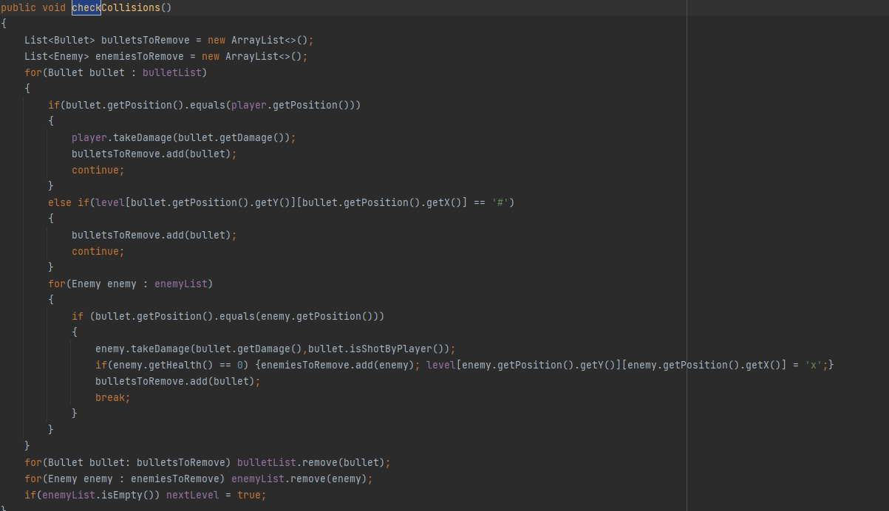
 
<b><i>Fig 13. Code Smell 1</i></b>
 

**Problem:** This is problematic because we are creating many ways to be followed by the code.

**Solution:** Extract Method

  
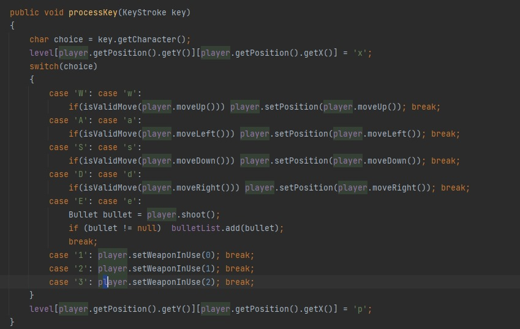
 
<b><i>Fig 14. Code Smell 2</i></b>
 

**Problem:** This is problematic because we are creating many ways to be followed by the code.

**Solution:** Extract Method

  
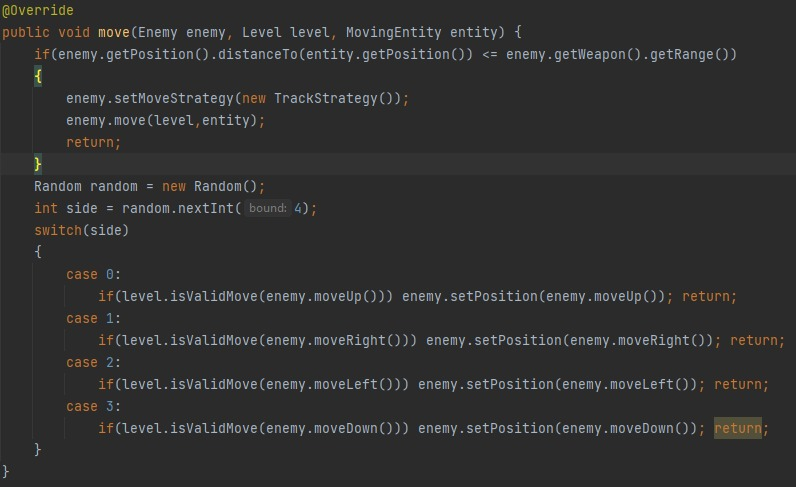
 
<b><i>Fig 15. Code Smell 3</i></b>
 

**Problem:** This is problematic because we are creating many ways to be followed by the code.

**Solution:** Extract Method and Move Method

### Testing

#### Screenshots of coverage report

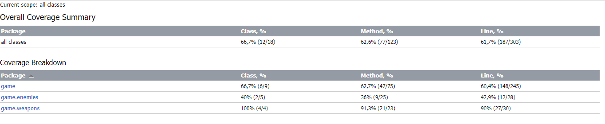
 
  <b><i>Fig 16. General Code coverage screenshot</i></b>
 

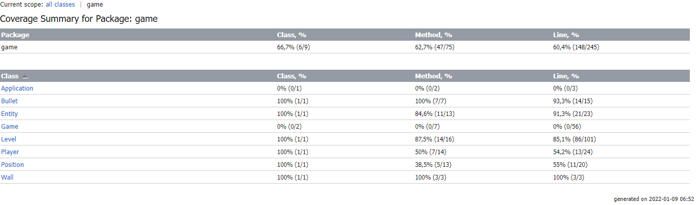
 
<b><i>Fig 17. Game Code coverage screenshot</i></b>
 

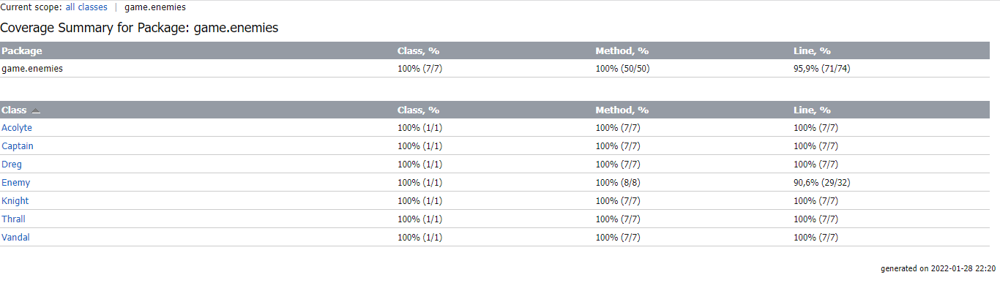
 
<b><i>Fig 18. Game.enemies Code coverage screenshot</i></b>
 

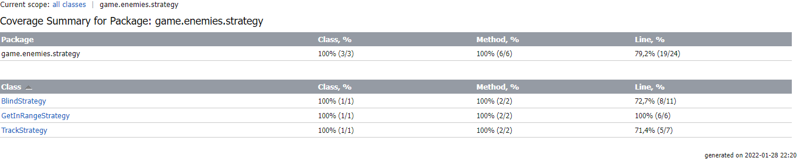
 
<b><i>Fig 19. Game.enemies.strategy Code coverage screenshot</i></b>
 

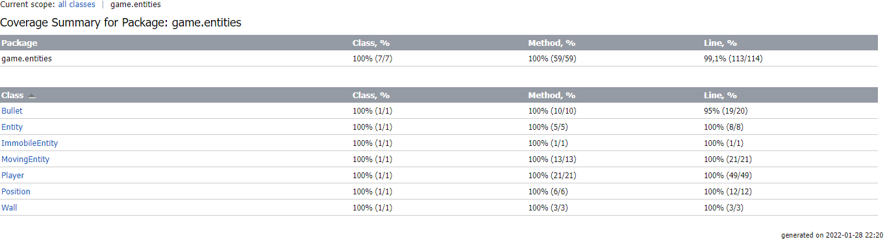
 
<b><i>Fig 20. Game.entities Code coverage screenshot</i></b>
 

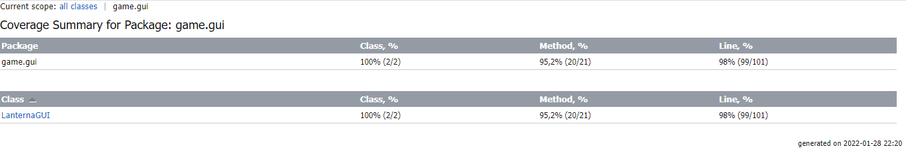
 
<b><i>Fig 21. Game.gui Code coverage screenshot</i></b>
 

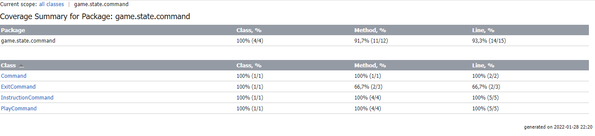
 
<b><i>Fig 22. Game.state.command Code coverage screenshot</i></b>
 

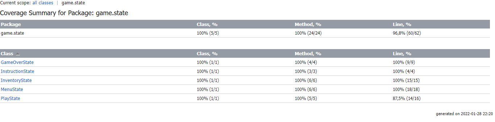
 
<b><i>Fig 23. Game.state Code coverage screenshot</i></b>
 

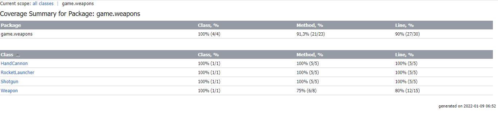
 
<b><i>Fig 24. Game.weapons Code coverage screenshot</i></b>
 

### Link to mutation testing report
[Mutation tests](../docs/pitestReport/pitest/202201282235/index.html)

### Self-evaluation

The work was divided in a mutual way, and we all contributed with our best. It helped us to enrich our java and principle/pattern knowledge, as well as our team work.

- Eduardo da Silva: 33.3%
- Ian Gomes: 33.3%
- Igor Diniz: 33.3%
